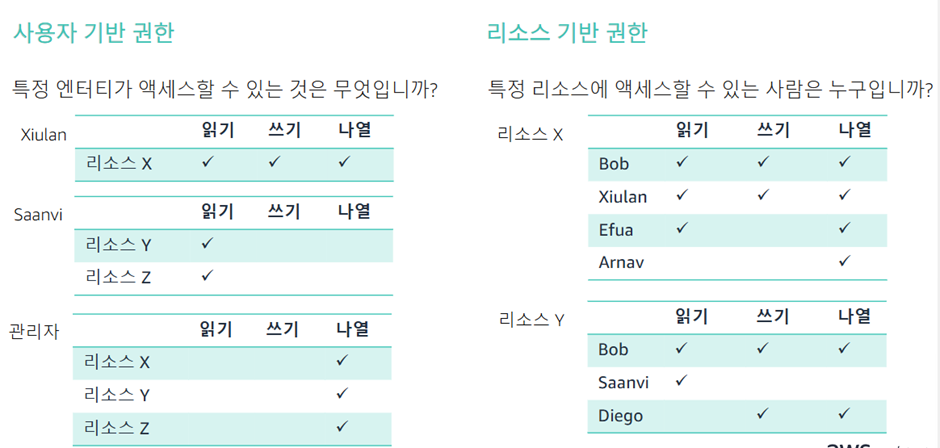

# AWS Identity 및 Access Management 검토

### IAM 검토

- 추가 비용 없이 AWS 계정의 기능으로 제공됨
- 사용자, 그룹 및 역할을 생성
- 정책을 사용하여 AWS 리소스에 대한 액세스를 제어

### AWS 서비스 액세스

- 프로그래밍 방식 액세스
    - 액세스 키 ID와 보안 액세스 키를 인증
    - APP 프로그램 인터페이스(API), AWS CLI, SW 개발 키트(SDK) 및 기타 개발 도구에 대한 액세스를 제공
- 콘솔 액세스
    - 계정 ID 또는 별칭, IAM  사용자 이름 및 암호를 사용
    - 이 옵션을 활성화하면 MFA에서 인증 코드를 물음

### 보안 인증 정보 유형

1. 이메일 주소 및 암호: AWS 계정 (루트 사용자)과 연결됨
2. IAM 사용자 이름 및 암호: AWS Management Console 액세스에 사용됨
3. 액세스 키: 일반적으로 API 및 SDK를 통한 프로그래밍 방식 요청 및 AWS CLI와 함께 사용됨
4. 다중 요소 인증(MFA): 추가 보안 계층, 계정 루트 사용자 및 IAM 사용자에 대해 활상화 가능
5. 키페어: Amazon EC2와 같은 특정 AWS 서비스에만 사용됨

### IAM 사용자 역할 위임

### IAM 모범사례

- 일상적 관리 업무에 루트 사용자 보안 인증정보를 사용하지 않음
- 계정 보안을 강화하기 위해 MFA를 구현
- IAM 역할을 사용해 교차 계정 액세스를 제공함
- 최소 권한의 원칙에 따라 관리 권한을 위임함