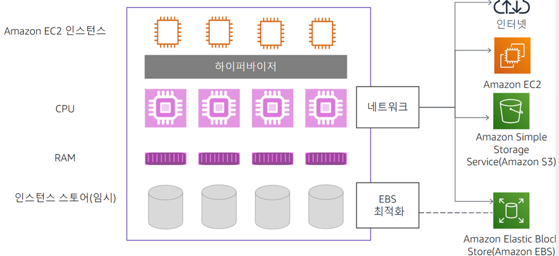

# AWS 기반 컴퓨팅

### EC2 가상화

### 인스턴스 유형

- 변형: CPU유형, 스토리지 유형, CPU or 코어 수, 스토리지 양, 메모리 양, 네트워크 성능
- 범주: 범용, 가속 컴퓨팅, 컴퓨팅 스토리지 메모리 최적화
- 패밀리: 범주 내 유형 모음
- 유형: 가상 하드웨어 기능 고유 선택

### 인스턴스 프로비저닝

### Amazon Machine Image (AMI)

- AMI 구성 요소
    - 인스턴스 볼륨 템플릿, 시작권한, 블록 디바이스 매핑
- AMI 선택 요소
    - AWS 제공, 사용자 구축, 커뮤니티, AWS Marketplace

### Amazon EC2 네트워킹

### IP 주소 유형

- 공인 IP 주소는 인스턴스를 중지했다가 다시 시작하면 변경됨
- 고정 공인 IP 주소에는 탄력적 IP 주소를 사용

### 보안그룹

- 인스턴스 액세스 제한 기준: 포트범위, IP 주소범위, 리소스 ID
- 인스턴스는 여러 보안 그룹과 연결 가능
- 인바우늗 및 아웃바운드 데이터 허용
- 시작 후 추가/수정 가능

### 인스턴스 프로파일

- Amazon EC2에 액세스 키와 비밀 키 로컬로 저장 방지
- AWS identity 및 IAM 역할을 인스턴스에 연결할 수 있도록 지원
- 액세스 키를 인스턴스에 자동 전파

### 사용자 데이터

- 시작 시 실행되는 스크립트: Linux 스크립트
- 스크립트 실행 주체: Linux의 Cloud-int

### EC2 인스턴스 메타데이터

- 실행중인 인스턴스를 구성 또는 관리하는데 사용할 수 있는 인스턴스 관련 데이터
- IP 주소 169.254.169.254에서 모든 인스턴스에 제공되는 메타데이터 서비스
- 인스턴스 메타데이터 쿼리

### 키 페어

- SSH-Linux
    - ssh를 사용하여 인스턴스에 로그인
    - Linux에서는 암호전용인증이 있음, 포트 22

### RDP-Windows

- RDP를 사용하여 인스턴스에 로그인
- 프라이빗 비밀 액세스 키만 사용하여 암호를 해독함, 암호화 된 무작위 암호 사용
- 포트 3389

### 시작 후 구성 옵션

1. 인스턴스 스크립 캡쳐 가져오기
2. 종료 방지 기능 활성화
3. 인스턴스가 라우터 또는 방화벽으로서 네트워크 주소 변환 (NAT) 기능을 수행하는 경우 소스 및 대상 확인 비활성화