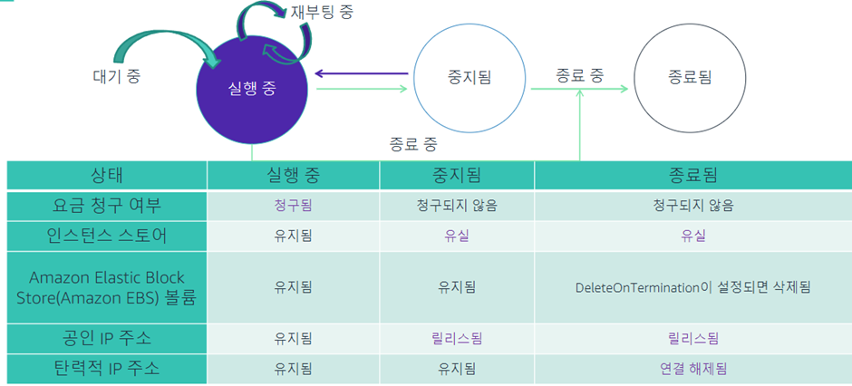

# AWS 인스턴스 관리

### EC2 인스턴스의 수명 주기상태

### EC2 인스턴스 최대 절전모드

### 최대 절전모드

- 사전 조건
    - 지원되는 인스턴스 유형 및 AMI
    - 암호화된 루트 EBS 볼륨
    - 온디맨드 인스턴스 또는 예약형 인스턴스

### 새로운 인스턴스 시작해야 하는 일반적 이유

- 오토스케일링, 비용절감, 다운그레이드, 손상된 인스턴스 복구, OS 아키텍처 또는 이미지 유형     업그레이드

### 새 인스턴스 크기로 전환

- 인스턴스 중지 → 인스턴스 수정 → 인스턴스 시작

### AMI 사용 중단

- AMI 사용 중단은 실행중인 인스턴스에 영향을 미치지 않음
- Windows AMI: 새 이미지 릴리스 후 사용 중단, 패치 후 5일 이내 릴리스 됨, AMI ID 아닌 이름으로 찾기
- Linux AMI: 수 년간 사용가능, 최신 Linux AMI 쿼리

### 실행중인 EC2 인스턴스 업데이트

- Window: 인스턴스는 윈도우 업데이트를 사용할 수 있음, 또는 수동으로 업데이트
- Linux: 인스턴스는 최초 시작 시 보안 업데이트를 설치