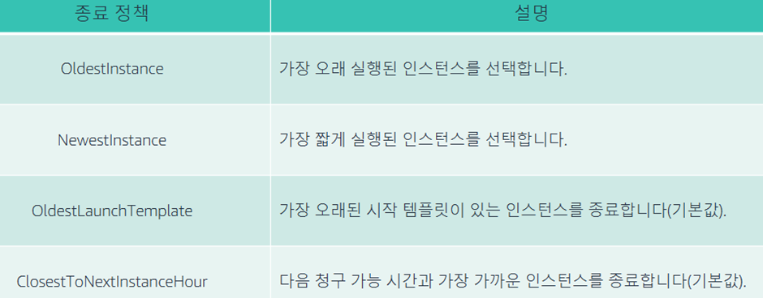

# EC2 Auto Scaling

### 다음을 기반으로 인스턴스를 자동으로 시작하거나 종료

- 상태확인, CloudWatch에서 지원하는 사용자 정의정책, 일정, 원하는 용량을 수동으로 사용, 수요에 맞춰 확장하고 비용을 절감하도록 축소

### Auto Scaling 실행 시작템플릿

- AMI, 인스턴스 유형, VPC, 보안그룹, 스토리지, 키 페어, IAM 역할, 사용자 데이터, 태깅

### Auto Scaling 그룹

- 최소, 원하는 값, 최대 범위에서 자동으로 조정
- Load Balancing과 통합
- 그룹 크기를 유지하기 위한 상태확인
- 인스턴스를 여러 가용영역에 분산 및 밸런싱
- 정책 트리거 방법: CloudWatch 경보, 대상추적, 예약, 수동
- 확장/축소 및 정도
    - ChangeInCapacity(+/-#)
    - ExactCapacity(#)
    - ChangeInCapacity(+/-%)

### Auto Scaling 및 인스턴스 상태

- 인스턴스의 상태 유지관리
- 비정상으로 표시된 인스턴스 종료
- 기본적으로 EC2 인스턴스 상태 확인 사용

### Auto Scaling 종료 정책

- 축소시 어떤 인스턴스를 종료할지 결정
- 인스턴스 수가 가장 많은 가용영역, 다중 정책 요인으로 종료 순서 결정

### 종료정책

### 안정된 상태 그룹 생성

- 그룹을 최소, 최대 및 원하는 값으로 설정
- 인스턴스가 비정상적 상태가 되거나 가용영역이 중단되면 인스턴스 자동으로 다시 생성
- 인스턴스가 재활용되는 동안 잠재적인 중단 시간

### 동적 스케일링

- 대상 추적조정
    - 특정 지표에 대한 목표 값을 기반으로 그룹의 현재 용량을 늘리거나 줄임
- 단계 조정
    - 경보 위반의 크기를 기반으로 하는 일련의 조정 조절을 기반으로 그룹의 현재 용량을 늘리거나 줄임
- 단순조정
    - 단일조정 조절을 기반으로 그룹의 현재 용량을 늘리거나 줄임

### 예측 스케일링

- 로드 예측, 최소 용량 예약