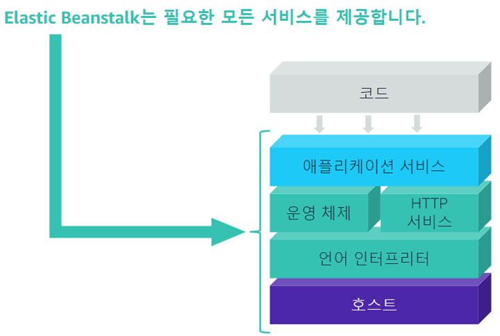

# Elastic Beanstalk, Load Balancing

### Elastic Beanstalk

- 서비스형 플랫폼 (PaaS)
- 신속한 웹 APP 배포, 크기 지정 및 관리, 관리의 복잡도 감소
- 인스턴스 유형선택, DB 선택, 오토스케일링 설정 및 조정
- APP 업데이트, 서버 로그 파일에 액세스, 로드 밸랜서에서 보안 HTTPS 활성화
- 다양한 플랫폼 및 언어 지원

## 구성요소

---

# Elastic load Balancing

### 로드 밸런서란

- EC2 인스턴스, 컨테이너, IP 주소 등을 여러 대상의 트래픽을 자동으로 분산시킴

### ELB 로드 밸런서 기능

- 고가용성, 상태확인, 보안기능, 전송계층 보안종료, 운영 모니터링, 4 7 계층 로드 밸런싱

### 유형

### 용례

- 보안: 단일지점을 통해 액세스
- 분리: APP 환경 분리
- 내결함성: 고가용성 및 내결함성 제공
- 확장성: 탄력성 및 확장성 증가

### Classic Load Balancer

- 단일 지점을 통해 서버에 액세스
- APP 환경 분리
- 고가용성 및 내결함성 제공
- 탄력성 및 확장성 증가

### Application Load Balancer

- 경로 기반 및 호스트 기반 라우팅
- 기본 IPV6 지원
- 동적포트, 추가지원 요청 프로토콜
- 삭제 방지 및 요청추적, 향상된 지표 및 액세스 로그
- 대상상태 확인

### Network Load Balancer

- 갑작스럽고 변동이 심한 트래픽 패턴
- 가용 영역 당 단일 고정 IP
- 최고 성능을 필요로 하는 APP에 적합합

---

# ELB 로드밸런서와 리스너

### 로드밸런서: 리스너

- 로드 밸런서가 수신대기하는 포트 및 프로토콜을 정의하는 프로세스
- 각 로드 밸런서는 트래픽을 수락하기 위해 하나 이상의 리스너가 필요, 최대 50개
- 대상으로 라우팅 규칙은 리스너에 정의됨

### 로드 밸런서: 대상 그룹

- 지원을 제공하는 등록된 대상그룹: EC2 인스턴스, 컨테이너 인스턴스
- 단일 대상에는 여러 대상그룹 등록이 있을 수 있음

