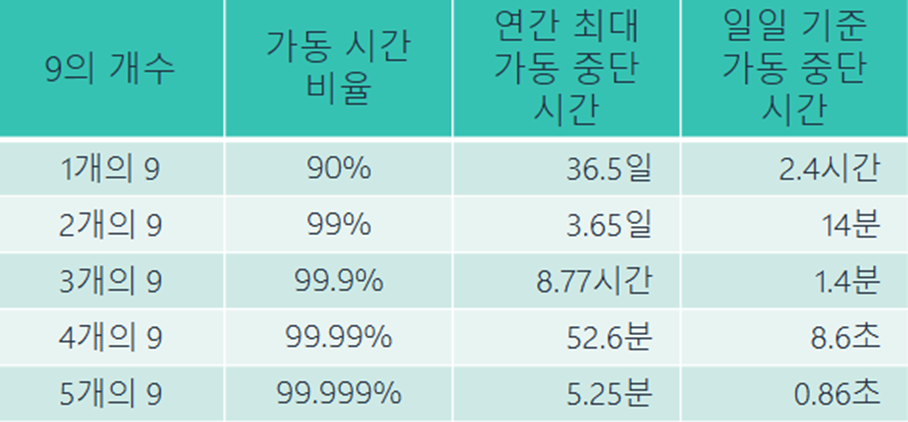

# 신뢰성 및 고가용성 이해

### 신뢰성

- 지정된 기간 동안 전체 시스템이 작동하는 확률
- 하드웨어, 펌웨어, 소프트웨어 포함
- 항목이 의도한 기능을 수행하는 기간을 측정

### 신뢰성에 대한 두가지 일반적 측정 방법

- 평균 장애 간격: 총 서비스 시간/장애 회수
- 장애율: 서비스 장애횟수/ 총 시간

### 가용성

- 리소스가 정상적으로 작동하는 시간을 측정
- 일정 기간에 걸친 작동시간
- 가용성 = 정상 작동시간/ 총 시간

### 고가용성(HA)

### HA 목표

- 시스템이 일반적으로 작동하며 액세스 할 수 있음
- 가동 중단 시간이 최소화됨
- 최소한의 인적 개입이 필요

### HA 주요 요소

- 내결함성:  APP 구성요소의 내장된 중복성과 작동 유지 능력
- 확장성: APP의 설계 변경 없이 성장을 수용하는 능력
- 복구성: 재해 발생 후 서비스 복구와 관련된 프로세스, 정책 및 절차

### 온프레미스 HA vs AWS HA

- 온프레미스
    - 많은 비용, 미션 크리티컬한 APP에만 적합

- AWS
    - 가용성 및 복구성 확장
    - 여러 대의 서버, 격리된 중복 데이터 센터, 내결함성 서비스